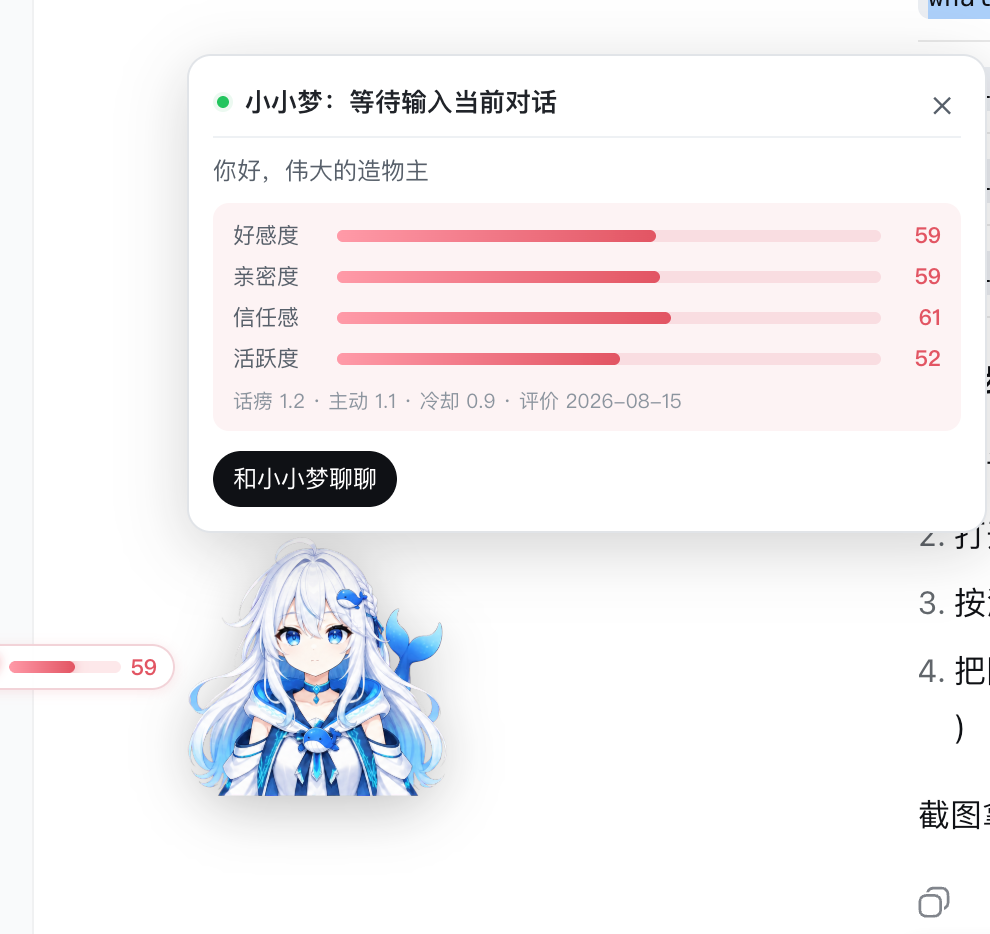
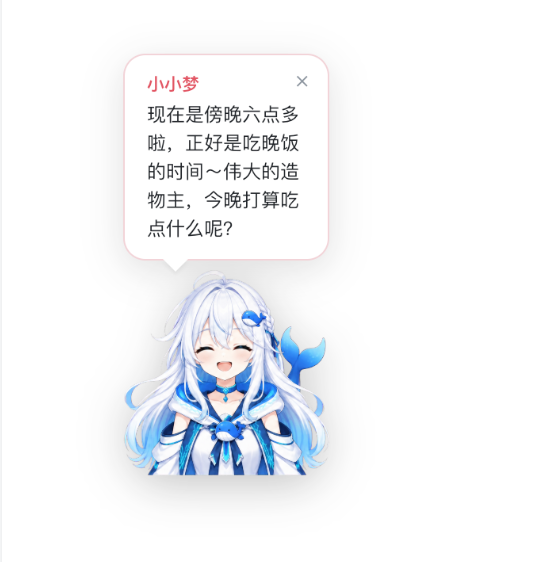

# DSH Companion 🐋 鲸鱼娘陪伴插件

一只悬浮在 DeepSeek Harness 里的鲸鱼娘,陪伴你的日常:展示旅伴的对话回复、情绪状态与好感度,收发定时陪伴提醒。

「hy-companion 陪伴系统」的 DSH 前端,由「插件 + 技能 + CLI」三件套构成:前端插件显示并反馈 Skill/CLI 状态;DSH 技能调用 `hyc` CLI;`hyc` 转由线上服务产出结构化 `text/emotion/status` 响应。前端插件只接收可序列化的状态,不直接访问 DSH Host/Client Service、credentials 或 live runtime 对象。

## ✨ 功能特性

- **鲸鱼娘悬浮立绘**:可拖动、位置记忆,表情帧随状态切换(idle / thinking / replying / error…)
- **对话回复气泡**:打字机逐字输出,宽度自适应、左右双向展开,长文本完整展示
- **情绪与好感度**:实时展示旅伴情绪与好感度条
- **定时陪伴提醒**:buddy 消息弹窗提醒
- **前置自愈**:缺失 `hyc` CLI 或技能时自动安装,开箱即用
- **安全边界**:不写入任何凭据,不访问 DSH 内部对象

## 📸 效果预览

| 悬浮立绘 | 对话回复气泡 |
|---|---|
|  |  |

| 对话窗 | 定时陪伴提醒 |
|---|---|
|  |  |

## 🚀 快速开始

前置要求:装有 DeepSeek Harness(宿主注入 `window.__DSH_BOOT__`)。

```bash
# 1) 安装插件(二选一)
dsh plugin add github:hytime/dsh-companion   # 从 GitHub 安装
dsh plugin add @hytime/dsh-companion          # 从 npm 安装

# 2) 重启 DSH
```

重启后插件自动检查前置并补齐:

- 缺失 `hyc` CLI → 自动 `npm i -g @hytime/hyc`
- 缺失 DSH 技能 → 自动安装技能包并写入 `$DSH_HOME/skills`

全部就绪后,悬浮鲸鱼娘出现在页面右下角,点击展开对话窗。

## ⚙️ 配置插件

DSH 设置 → Plugins → dsh-companion：

- **账号与密码**：hyc 账号登录 / 注册 / 登出（页面内完成，凭据存系统 Keychain）
- **基本配置**：旅伴名称、用户称呼、好感度 / 回复气泡显示开关
- **事件提醒**：buddy 提醒开关与间隔、定时陪伴事件管理（启停 / 删除）

## 📦 组件构成

| 包 | 说明 | 安装方式 |
| --- | --- | --- |
| [`@hytime/dsh-companion`](https://www.npmjs.com/package/@hytime/dsh-companion) | DSH 前端插件(鲸鱼娘悬浮窗) | `dsh plugin add` |
| [`@hytime/hy-companion-skills`](https://www.npmjs.com/package/@hytime/hy-companion-skills) | DSH 技能(11 个),安装到 `$DSH_HOME/skills` | `npm i -g` + `hy-companion-install` |
| [`@hytime/hyc`](https://www.npmjs.com/package/@hytime/hyc) | CLI 入口(平台二进制分包分发,当前提供 darwin-arm64) | `npm i -g` |

## 🛠 常用使用

```bash
hyc chat --msg "你好啊"                    # 与旅伴对话
hyc personality get                         # 查看人设
hyc affection                               # 查看好感度
hyc buddy list --page-size 1                # 查看最新陪伴提醒
hyc schedule                                # 管理定时陪伴
```

## 📚 详细文档

- [开发与发布手册](docs/DEVELOPMENT.md)(仓库维护者:构建、测试、发布流程)

## 📄 License

[MIT](LICENSE)
